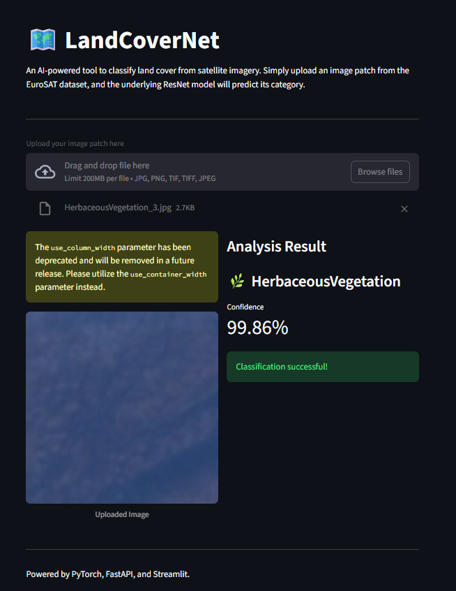

# 🗺️ LandCoverNet: A GeoAI Land Cover Classification System

LandCoverNet is a complete, end-to-end machine learning application built as a demonstration of a modern GeoAI workflow. It uses a deep learning model to classify land cover from satellite image patches and exposes the functionality through both a REST API and an interactive web frontend.

This project was developed as a showcase for an Esri interview, demonstrating skills in raster data handling, deep learning, API development, and creating user-centric geospatial applications.



---

## ✨ Features

- **High-Accuracy Deep Learning Model:** Utilizes a **ResNet18** model, pre-trained on ImageNet and fine-tuned on the **EuroSAT dataset**, achieving >95% validation accuracy for 10 distinct land cover classes.
- **Robust REST API:** A backend built with **FastAPI** provides a scalable and documented `/predict` endpoint for classifying uploaded image patches.
- **Interactive Web Frontend:** A user-friendly interface built with **Streamlit** allows for easy interaction with the model. Features include:
    - Drag-and-drop file uploader for custom images.
    - Pre-loaded demo scenarios for instant testing.
    - An **interactive map** that provides real-world geospatial context for demo classifications.
- **Containerized & Reproducible:** The API is containerized with **Docker** for easy deployment and scalability. *(Mention this if you've added the Dockerfile)*
- **End-to-End Workflow:** Demonstrates the full lifecycle of a GeoAI project: data preprocessing, model training, evaluation, API serving, and frontend development.

---

## 🛠️ Tech Stack

- **Backend:** Python, FastAPI, Uvicorn
- **Machine Learning:** PyTorch, Torchvision, Scikit-learn
- **Geospatial Data Handling:** Rasterio
- **Frontend:** Streamlit
- **Core Libraries:** Pandas, NumPy, Pillow
- **Development Environment:** WSL2 (for GPU-accelerated training), Conda/Venv, Docker

---

## 🚀 Getting Started

Follow these instructions to set up and run the project locally.

### Prerequisites

- Python 3.9+
- An environment manager like Conda or `venv`
- Git (for cloning the repository)

### 1. Clone the Repository

```bash
git clone https://github.com/your-username/your-repo.git
cd your-repo
```
*(Replace the URL with your own)*

### 2. Set Up the Python Environment

This project includes a `requirements.txt` file to ensure all dependencies are installed correctly.

```bash
# Create a virtual environment
python -m venv venv

# Activate the environment
# On Windows:
.\venv\Scripts\activate
# On macOS/Linux:
source venv/bin/activate

# Install the required packages
pip install -r requirements.txt
```

### 3. Run the Application Stack

The application consists of two parts: the backend API and the frontend web app. You will need to run them in **two separate terminals**.

**Terminal 1: Start the Backend API (FastAPI)**

```bash
uvicorn main:app --reload
```
The API will now be running at `http://127.0.0.1:8000`. You can access the interactive API documentation at `http://127.0.0.1:8000/docs`.

**Terminal 2: Start the Frontend App (Streamlit)**

```bash
streamlit run frontend.py
```
A new tab should automatically open in your browser with the web application. If not, navigate to `http://127.0.0.1:8501`.

### 4. (Optional) Running with Docker

If you have Docker installed, you can build and run the backend API in a container.

```bash
# Build the Docker image
docker build -t landcovernet-api .

# Run the container
docker run -d -p 8000:8000 --name landcovernet landcovernet-api
```
The API will be accessible just as before. You would still run the Streamlit frontend in a separate terminal.

---

## 🔮 Future Extensions

This project serves as a strong foundation. Future work could include:
- **Full Raster Classification:** Implement a sliding window algorithm to classify large GeoTIFFs instead of just small patches.
- **Semantic Segmentation:** Replace the classification model with a segmentation model (like U-Net) to produce pixel-level prediction maps.
- **Batch Processing:** Add an endpoint to handle batch uploads for classifying multiple images at once.
- **Cloud Deployment:** Deploy the Dockerized API to a cloud service like AWS ECS or Google Cloud Run for a publicly accessible endpoint.

